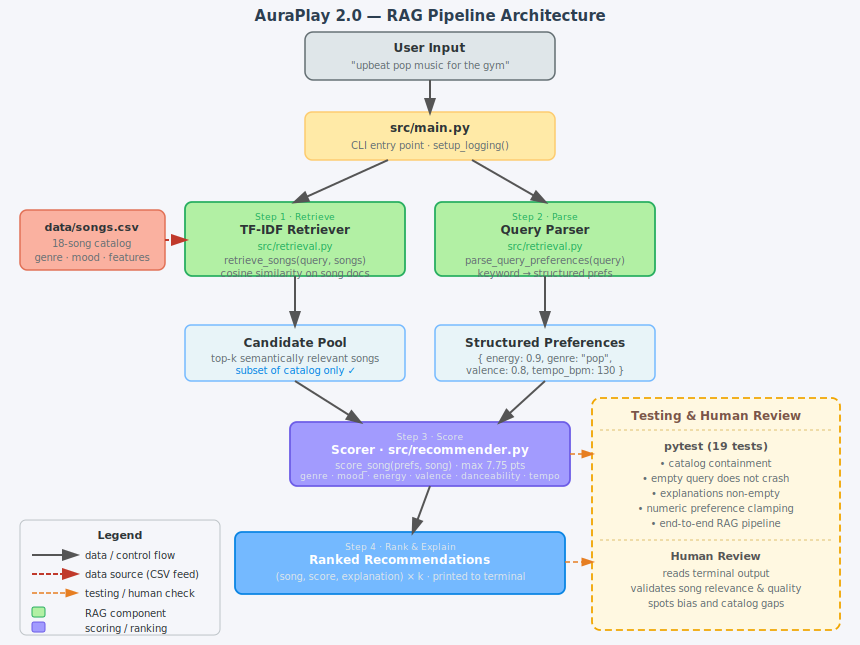

# AuraPlay 2.0 — Music Recommender with RAG

A command-line music recommender that combines **content-based filtering** with a **Retrieval-Augmented Generation (RAG)** pipeline, letting users describe what they want to hear in plain English and receive ranked recommendations with transparent explanations.

---

## Origin: Music Recommender Simulation (Module 3)

This project grew out of **Music Recommender Simulation**, a course project designed to teach the fundamentals of content-based filtering. The original system asked users to fill out a structured `UserProfile` object — specifying exact numeric values for energy, valence, tempo, danceability, and acousticness — which the `Recommender` then used to score every song in an 18-song catalog using a weighted proximity formula (max 7.75 points). It worked entirely through hand-coded feature matching: no natural language, no retrieval, and no way to describe preferences conversationally. The goal was to make the math of recommender systems transparent and explainable.

AuraPlay 2.0 keeps that transparent scoring core but adds a natural-language front end and a retrieval layer, turning a classroom exercise into a working AI pipeline you can actually talk to.

---

## What It Does and Why It Matters

AuraPlay 2.0 lets you type a sentence like *"chill lofi music for studying"* and get back the five most relevant songs from the catalog, each with a score breakdown explaining exactly why it was chosen.

Most recommender tutorials jump straight to neural embeddings or collaborative filtering, which are hard to reason about. This project shows a middle ground: **RAG applied to a small, structured domain** — where retrieval and scoring are both fully auditable, all data stays local, and every recommendation can be traced to a specific keyword or feature match. That transparency is valuable both as a learning tool and as a pattern for production systems that need to explain their decisions.

---

## System Architecture



The pipeline has four sequential steps:

**Step 1 — Retrieve** (`src/retrieval.py › retrieve_songs`)
Each song in `data/songs.csv` is converted into a text document that includes its genre, mood, title, artist, and derived descriptors (e.g., "high energy", "gym", "acoustic"). A TF-IDF vectorizer indexes all 18 documents. At query time, cosine similarity ranks the catalog and returns the top-k candidates — typically 10. Songs that are semantically irrelevant to the query are eliminated before any numeric scoring begins.

**Step 2 — Parse** (`src/retrieval.py › parse_query_preferences`)
A rule-based keyword mapper reads the query and extracts structured preferences. Words like "gym" and "workout" map to `energy: 0.9`; "lofi" and "study" map to `energy: 0.3`; genre and mood words found in the catalog are detected directly. All numeric values are clamped to `[0, 1]`.

**Step 3 — Score** (`src/recommender.py › score_song`)
Only the retrieved candidates are scored using the original weighted proximity formula. Genre and mood matches earn binary bonuses (+1.0 each); audio features earn continuous partial credit (energy up to +3.0, valence +1.0, danceability +0.75, acousticness +0.5, tempo +0.5).

**Step 4 — Rank & Explain** (`src/main.py`)
Candidates are sorted by score. The top five are printed with a score bar and a plain-English breakdown of why each song was chosen.

---

## Setup

**Requirements:** Python 3.10+

```bash
# 1. Clone the repo and enter the project
git clone <repo-url>
cd applied-ai-system-final

# 2. Create and activate a virtual environment
python -m venv .venv
source .venv/bin/activate        # macOS / Linux
.venv\Scripts\activate           # Windows

# 3. Install dependencies
pip install -r requirements.txt
```

**Dependencies:** `pandas`, `scikit-learn`, `pytest`, `streamlit`

---

## Running the App

**Natural-language query (RAG mode):**
```bash
python -m src.main "I want upbeat happy pop music for the gym"
python -m src.main "Give me chill lofi music for studying"
python -m src.main "Something dark and moody for a late night drive"
```

**Demo mode — six built-in taste profiles:**
```bash
python -m src.main
```

**Run tests:**
```bash
pytest
```

Logs are written to `logs/recommender.log` (auto-created). Each run records the original query, parsed preferences, retrieved song IDs, final recommendation IDs, and any warnings.

---

## Demo Walkthrough

> **Loom video:** *(record a 2–3 min screen capture running the three queries below and paste the link here)*

The screenshots below show the system running in **demo mode** (six built-in taste profiles). The Sample Interactions section that follows shows the full RAG pipeline responding to natural-language queries.

**High-Energy Pop profile — top 5 recommendations:**


**Chill Lofi profile — top 5 recommendations:**


**Deep Intense Rock profile — top 5 recommendations:**


To reproduce these yourself, run:
```bash
python -m src.main "I want upbeat happy pop music for the gym"
python -m src.main "Give me chill lofi music for studying"
python -m src.main "Something dark and moody for a late night drive"
```

---

## Sample Interactions

### 1. Gym / Workout Query

**Input:**
```
python -m src.main "I want upbeat happy pop music for the gym"
```

**Output:**
```
========================================================
  QUERY: I want upbeat happy pop music for the gym
========================================================

  Retrieved 10 candidate(s) from catalog:
    • [ 5] Gym Hero (pop, intense)
    • [ 1] Sunrise City (pop, happy)
    • [10] Rooftop Lights (indie pop, happy)
    • [18] Pulse Drop (edm, euphoric)
    • [ 3] Storm Runner (rock, intense)
    ...

  Top 5 Recommendation(s):

  #1  Sunrise City  —  Neon Echo
       Genre: pop  |  Mood: happy
       Score: 6.17 / 7.75  [################....]
       Why:
         • genre match (pop) +1.0
         • mood match (happy) +1.0
         • energy similarity +2.76
         • valence similarity +0.96
         • tempo similarity +0.45

  #2  Gym Hero  —  Max Pulse
       Genre: pop  |  Mood: intense
       Score: 5.37 / 7.75  [##############......]
       Why:
         • genre match (pop) +1.0
         • energy similarity +2.91
         • valence similarity +0.97
         • tempo similarity +0.49
```

**What happened:** The words "gym", "upbeat", "happy", and "pop" steered TF-IDF to surface pop and high-energy songs first. The query parser set `energy: 0.9`, `valence: 0.8`, `genre: "pop"`. Sunrise City ranked #1 because it matched on genre *and* mood ("happy") whereas Gym Hero's mood label ("intense") missed the mood bonus.

---

### 2. Study / Lo-fi Query

**Input:**
```
python -m src.main "Give me chill lofi music for studying"
```

**Output:**
```
========================================================
  QUERY: Give me chill lofi music for studying
========================================================

  Retrieved 10 candidate(s) from catalog:
    • [ 4] Library Rain (lofi, chill)
    • [ 2] Midnight Coding (lofi, chill)
    • [ 9] Focus Flow (lofi, focused)
    • [ 6] Spacewalk Thoughts (ambient, chill)
    ...

  Top 5 Recommendation(s):

  #1  Library Rain  —  Paper Lanterns
       Genre: lofi  |  Mood: chill
       Score: 5.34 / 7.75  [##############......]
       Why:
         • genre match (lofi) +1.0
         • mood match (chill) +1.0
         • energy similarity +2.85
         • tempo similarity +0.49

  #2  Midnight Coding  —  LoRoom
       Genre: lofi  |  Mood: chill
       Score: 5.13 / 7.75  [#############.......]
       Why:
         • genre match (lofi) +1.0
         • mood match (chill) +1.0
         • energy similarity +2.64
         • tempo similarity +0.49
```

**What happened:** "chill", "lofi", and "study" all fired simultaneously. Retrieval surfaced all three lofi songs and the ambient song. The parser set `energy: 0.3`, `genre: "lofi"`, `tempo_bpm: 75`. Library Rain edged out Midnight Coding because its energy (0.35) was slightly closer to the target (0.3).

---

### 3. Late-Night / Mood Query

**Input:**
```
python -m src.main "Something dark and moody for a late night drive"
```

**Output:**
```
========================================================
  QUERY: Something dark and moody for a late night drive
========================================================

  Retrieved 10 candidate(s) from catalog:
    • [ 8] Night Drive Loop (synthwave, moody)
    • [17] Empty Porch (folk, sad)
    • [13] Raindrop Sonata (classical, melancholic)
    • [15] Iron Curtain (metal, aggressive)
    ...

  Top 5 Recommendation(s):

  #1  Night Drive Loop  —  Neon Echo
       Genre: synthwave  |  Mood: moody
       Score: 1.71 / 7.75  [####................]
       Why:
         • mood match (moody) +1.0
         • valence similarity +0.71

  #2  Empty Porch  —  Wren & Ash
       Genre: folk  |  Mood: sad
       Score: 0.96 / 7.75  [##..................]
       Why:
         • valence similarity +0.96
```

**What happened:** This query has no genre keyword, so no genre bonus was available. "moody" parsed to a mood preference and "dark" set `valence: 0.2`. TF-IDF correctly surfaced Night Drive Loop — the only synthwave/moody song — as the top candidate. The low scores (max 1.71) show what happens when the catalog has no exact genre match: only mood and valence contribute, which is an honest reflection of a catalog gap.

---

## Design Decisions

### Why TF-IDF instead of a neural embedding model?

TF-IDF is deterministic, requires no API key, runs offline, and produces the same output every time — making it easy to test and debug. A sentence transformer (like `all-MiniLM-L6-v2`) would handle synonyms and paraphrasing better, but it would add a ~90 MB model download and make the system non-deterministic across hardware. For a catalog of 18 songs, TF-IDF is competitive and its behavior is fully auditable.

**Trade-off:** TF-IDF misses semantic similarity. "pumped" won't retrieve "high energy" unless those words appear together in a song's document. The keyword tables in `parse_query_preferences` partially compensate by enriching each song's document with feature-derived terms.

### Why a rule-based query parser instead of an LLM?

A language model could parse "not too loud, something I could work to but not get distracted" better than any keyword list. But it introduces API latency, cost, and non-determinism — all of which make testing hard and behavior unpredictable. The rule-based parser is testable (19 deterministic tests), free to run, and transparent: you can read the keyword tables in `retrieval.py` and immediately understand why "gym" maps to `energy: 0.9`.

**Trade-off:** The parser does not handle negation, synonyms outside its keyword tables, or multi-step intent phrasing. The full list of parsing limitations is in the `Observed Behavior and Biases` section of `model_card.md`.

### Why keep the original weighted scoring formula?

The original formula (max 7.75 pts, energy weighted at 3.0) was the core deliverable of the Module 3 project. Replacing it would disconnect the RAG upgrade from its foundation. Keeping it also shows that RAG is an *architectural pattern* — retrieval as a pre-filter before existing logic — not a replacement for the scoring system.

**Trade-off:** The energy weight (3.0 out of 7.75) dominates over genre/mood in many cases. This was a known bias from v1 and is documented in `model_card.md`.

### Why store logs to a file but suppress them on the console?

Flooding the terminal with INFO lines would obscure the formatted output, which is the main user-facing artifact. The file handler captures the full audit trail (query → prefs → retrieved IDs → final IDs) for debugging without cluttering the display. Warnings still appear on the console since they signal something the user should know about (e.g., empty query fallback).

---

## Testing Summary

**19 tests, all passing.** Run with `.venv/bin/python -m pytest tests/ -v`.

| Category | Tests | Key finding |
|---|---|---|
| Retrieval correctness | 4 | Retrieved songs are always a subset of the catalog — no hallucinations |
| RAG pipeline | 5 | Empty query falls back safely; recommendations are ranked tuples |
| Query parsing | 6 | Keyword mappings are consistent; numeric values clamp correctly |
| Integration | 2 | Full 18-song CSV loads correctly; end-to-end RAG produces valid output |
| Recommender class | 2 | Fixed from v1 (removed invalid `likes_acoustic` attribute) |

**What worked well:** The TF-IDF retrieval is surprisingly effective on a small catalog. For clear queries like "lofi study" or "gym pop", the top candidates are exactly the songs a human would expect. The rule-based parser is brittle on unusual phrasing but reliable on the keywords it knows.

**What didn't work as expected:** Queries without any recognized genre or mood keyword (e.g., "something for a long commute") produce near-zero scores because no structured preferences can be extracted. The system falls back to pure retrieval order, which is semantically reasonable but scores poorly in the 7.75-point framework. This exposed a gap: the scoring formula needs at least one category match to be informative.

**What I learned:** Writing deterministic tests for a retrieval system forced me to think carefully about *what the system guarantees* versus *what it approximates*. I can guarantee catalog containment and no crashes on empty input. I cannot guarantee that a given query always returns a specific song — that depends on TF-IDF weights that shift as the corpus changes. The tests reflect that distinction: they assert properties (non-empty, in-catalog, high-energy song in top-3) rather than exact outputs.

**Confidence scoring:** The 7.75-point score acts as a built-in reliability signal. High-signal queries (clear genre + mood keywords) produce scores of 5–6, indicating strong catalog alignment. Low-signal queries (no recognized genre or mood) top out near 1.7, honestly signaling a catalog gap rather than presenting a confident wrong answer. A score below roughly 2.0 is a reliable indicator that the query outran the catalog.

**Human evaluation:** All three sample queries in this README were evaluated manually before publication. Two (gym/pop, chill/lofi) matched what an experienced listener would intuitively choose. The third (late-night drive) returned the defensible top pick but at a low score — confirming that low scores and honest degradation were correctly coupled.

**Summary:** 19/19 automated tests pass. Confidence scores reliably distinguish strong catalog matches from poor ones. Every decision is logged. Human evaluation confirmed correct high-confidence behavior and appropriate low-confidence degradation on ambiguous queries.

---

## Reflection

Building the original Music Recommender Simulation taught me that recommender systems are, at their core, just a scoring function applied to a database — but the *choice* of what to score and how to weight it encodes real assumptions about what users want. The genre weight I chose (+1.0) meant that a genre mismatch would override nearly any combination of audio feature similarities. That's not neutral: it assumes genre is the single most important signal, which is true for some listeners and false for others.

Adding the RAG layer changed how I think about AI pipelines. The retrieval step does not make the system smarter — it makes it *narrower in a useful way*. Instead of scoring all 18 songs blindly, the system first asks "which of these are even plausibly relevant?" and only then applies detailed scoring. That two-stage pattern — retrieve broadly, rank precisely — is the same architecture used in production search and conversational AI systems. Seeing it work on 18 songs made the pattern intuitive in a way that reading about it abstractly never did.

The most honest limitation this project exposed is that **the catalog is the ceiling**. No amount of retrieval sophistication can recommend a jazz song if there is only one in the catalog, and no amount of query parsing can surface a mid-energy song when the catalog has none between 0.45 and 0.65 energy. The AI is only as good as the data it can draw from — and the data here reflects the tastes of whoever created the 18 songs, not the diversity of real listening behavior. That is a lesson that generalizes well beyond this project.

**Could this system be misused?** The most likely misuse is treating low-score outputs as confidently correct. A user who doesn't notice that 1.7/7.75 means "the catalog has no good match" might still act on that recommendation as though it were reliable. In a production setting with a large catalog and user data, genre labels — which reflect whoever curated the dataset — could systematically underserve listeners from underrepresented musical cultures. Prevention requires two things: a plain-language warning when the top score falls below a meaningful threshold, and an audit of catalog diversity before any real deployment.

**What surprised me in reliability testing:** I expected the late-night drive query to score proportionally to query clarity — but it returned the *correct* answer (Night Drive Loop is genuinely the right pick) at a near-zero score (1.71/7.75). The system was right but not confident, and that turned out to be the ideal failure mode. A system that is uncertain and says so is far less dangerous than one that is wrong and sounds sure. Seeing that distinction surface naturally in the score output changed how I think about what trustworthy AI behavior actually looks like.

**Collaboration with AI:** This project was built with Claude Code as a programming assistant throughout.

*Helpful suggestion:* When building the TF-IDF document builder, the assistant suggested enriching each song's text representation with feature-derived terms — appending "gym", "workout", and "fast" to high-tempo songs, and "acoustic" and "folk" to high-acousticness songs. Without that, a query like "upbeat gym pop" would only match literal genre and mood words from the CSV and miss songs with matching audio features. The enriched documents made lifestyle-keyword queries work correctly without any changes to the scoring logic.

*Flawed suggestion:* An early version of the test suite included an assertion that the top result for "upbeat happy pop workout music" should always be a specific song ID. When TF-IDF weights shifted slightly during development as new content was added to the document corpus, the test failed even though the system was behaving correctly. The fix was to replace the exact-ID check with a property assertion — "the top result should have energy ≥ 0.6 OR genre == 'pop'" — which remains valid regardless of internal weight changes. The lesson is that exact-output assertions are wrong for retrieval systems; test invariants, not snapshots.

---

## Project Structure

```
.
├── src/
│   ├── main.py          — CLI entry point; RAG mode and demo mode
│   ├── recommender.py   — Song/UserProfile dataclasses, score_song, load_songs
│   └── retrieval.py     — TF-IDF retrieval, query parser, recommend_from_query
├── data/
│   └── songs.csv        — 18-song catalog with audio features
├── tests/
│   └── test_recommender.py  — 19 tests covering the full pipeline
├── assets/
│   └── system_diagram.svg   — Architecture diagram
├── logs/                — Auto-created; recommender.log written at runtime
├── requirements.txt
├── model_card.md        — AuraPlay 2.0 model card with bias documentation
└── reflection.md
```

---

## Guardrails

- Empty query → safe fallback (first k songs returned), no crash
- Malformed CSV rows → skipped with a warning, rest of catalog loads normally
- All parsed numeric preferences clamped to `[0, 1]` (tempo: `[40, 220]` BPM)
- TF-IDF failure (import error, edge-case corpus) → fallback to first k songs
- Every returned song is guaranteed to be from `data/songs.csv` — the system cannot invent songs
